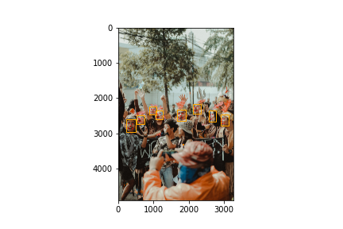

# Face and Facial features extraction using MTCNN 

Face detection is a computer vision problem that involves finding faces in photos.

It is a trivial problem for humans but indeed a challenging one for machines. More recently deep learning methods have achieved state-of-the-art results on standard benchmark face detection datasets. One such algorithm is the Multi-task Cascade Convolutional Neural Network (MTCNN), described by Kaipeng Zhang, et al. in the 2016 paper titled [“Joint Face Detection and Alignment Using Multitask Cascaded Convolutional Networks.”](https://arxiv.org/abs/1604.02878)

MTCNN extracts face and other facial features including nose, mouth and eyes from any fiven picture or frames in a video with very high accuracy. It is a very popular and powerful technique used in pre-processing for Face Recognition tasks. MTCNN can also be used for Facial Landmark Detection.

Here, we will use on opensource implementation of MTCNN to extract the face, and other features and draw bounding boxed around them.

Some examples of outputs of the algorithm are as follows:

.png)

